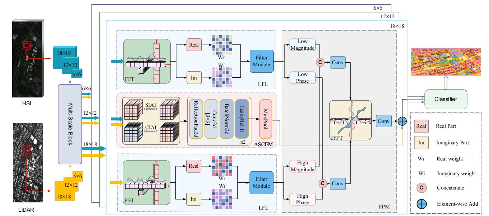

# MDAF-Net: Multi-Domain Adaptive Fusion Network for Multi-Source Remote Sensing Data Classification

 

    

## 📌 Overview

MDAF-Net is a novel multimodal fusion framework designed for joint classification of hyperspectral imaging (HSI) and LiDAR data.

The proposed network integrates:

- Multi-scale feature extraction
- Adaptive spatial-channel interaction
- Frequency-aware fusion

to fully exploit complementary information across:

- Spatial domain
- Spectral domain
- Frequency domain

Extensive experiments demonstrate that MDAF-Net achieves state-of-the-art performance on multiple public remote sensing datasets.

---

## 👉 Data

We conducted 10 distinct data partitions based on [IF_CALC](https://github.com/Ding-Kexin/IF_CALC/blob/main/Model/index_2_data.py) implementation and adopted the average results across these iterations as the final reported outcomes in our study.

* [Houston](https://hyperspectral.ee.uh.edu/)

* [MUUFL](https://github.com/GatorSense/MUUFLGulfport/)

* [Trento](https://github.com/danfenghong/IEEE_GRSL_EndNet/blob/master/README.md)

## 🌈 Results

| Dataset  | OA (%) | AA (%) | Kappa (%) |
|----------|--------|--------|-----------|
| Houston    | 96.02 |  96.63 |    95.70  |
| MUUFL   | 85.61 |  85.08 |    81.39  |
| Trento  | 99.51 |  98.96 |    99.34  |

## 🌿 Getting Started

### Environment Setup

To get started, we recommend setting up a conda environment and installing dependencies via pip. Use the following commands to set up your environment.
    
    conda create -n mdafnet python==3.11
    
    conda activate mdafnet
    
    pip install -r requirements.txt
    

### Train and Test
    python demo.py

### Citation
If this code is useful for your research, please cite this paper.

## 🌸 Acknowledgment

We are deeply grateful to repositories [IF_CALC](https://github.com/Ding-Kexin/IF_CALC), [GLT](https://github.com/Ding-Kexin/IEEE_TGRS_GLT-Net) and [FDNet](https://github.com/RSIP-NJUPT/FDNet.git), which served as the foundational basis for our code implementation.
